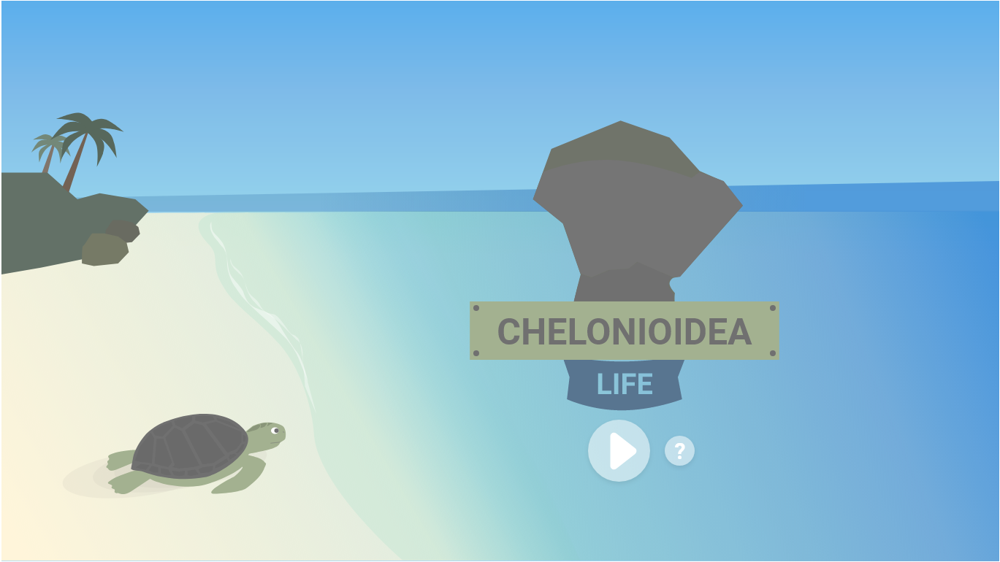

# THE F2E 2nd : 90sGame

## DEMO

[海龜逃出](https://g6165310.github.io/90sGame/)

\*內有音樂，請注意音量

## 遊戲說明

- 使用方向鍵(上下左右)進行移動
- 躲避畫面中的 4 種廢棄物
- 最後 30 秒會出現水母，吃掉水母回復生命

## 攻略心得

### 本次攻略重點是使用 [Phaser.js](https://phaser.io/phaser3) 框架

1.  使用 new Phaser.Game(config) 建立一個遊戲環境，並在 config 中掛載到 index 上的 #app 上。

        //config包含一些基本設定
        const config = {
          type: Phaser.AUTO,
          width: 1366,
          height: 768,
          parent: 'app',
        };
        const game = new Phaser.Game(config);

2.  建立場景

        const FirstScene = {
          // key 為在遊戲世界中獨有的識別
          key:"FirstScene",
          //預先載入階段
          preload(){},
          //建立實際物件
          create(){},
          //畫面每幀更新執行
          update(){}
        }

3.  資源載入(預載階段)

    根據不同類型的資源進行物件的預載

        * this 為當前的scene
        //圖片
        this.load.image("key","資源位置")
        //音檔
        this.load.audio("key","資源位置")
        //sprite
        this.load.spritesheet("key","資源位置",{frameWidth,frameHeight})

4.  物件實際的建立

        ex:
        this.add.image()
        this.add.sprite()
        //會不斷重複的
        this.add.tileSprite()

5.  物理引擎

    - 設定物理世界

          //在前面提到的 config 中加入
          physics: {
            default: 'arcade',
            arcade: {
              //這裡可以任意添加想要的物理條件
              gravity: { y: 0 },
            },
          }

    - 邊界設定

          //canvas 預設左上的頂點為 (0,0)
          this.physics.world.setBounds(起始x,起始y,寬度,高度)

    - 添加物件到物理世界

          //將現存的物件改為加到物理世界
          this.physics.add.existing(object)
          //直接向物理世界加入特定型態的物件
          ex:
          this.physics.add.sprite(object);

    - 碰撞

          this.physics.add.collider(物件1,物件2,callback)

## 美術來源

- [Chrispy](https://challenge.thef2e.com/user/2872?schedule=3795#works-3795)
